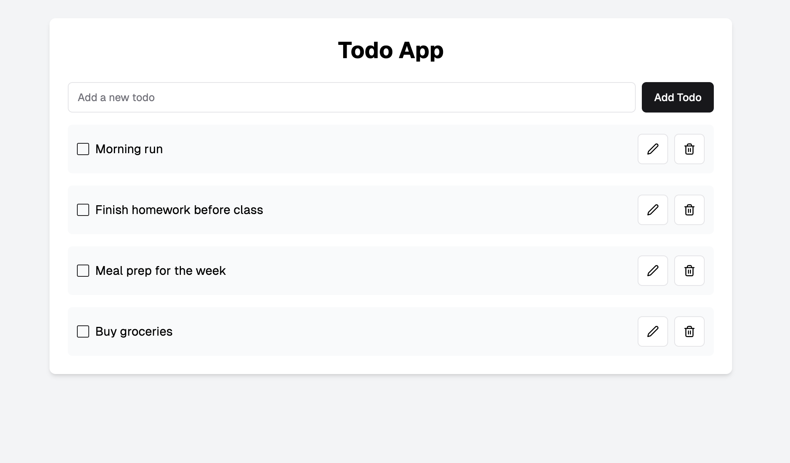
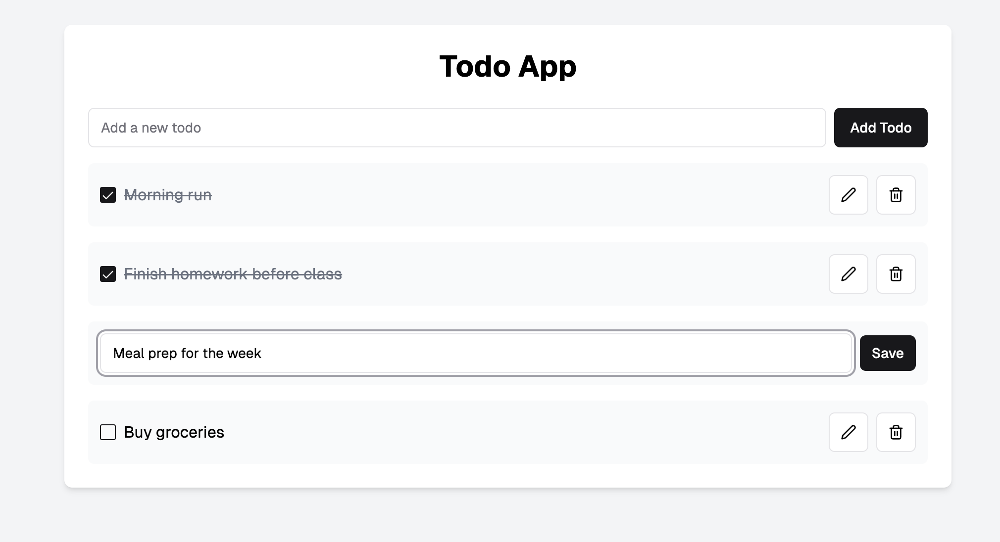

# Todo App with MongoDB

To get started, install dependencies:  
```bash
npm install
```

Then, run the development server:  
```bash
npm run dev
```

Open the following link to verify the server is running:  
```bash
http://localhost:8000/api/v1/projects
```

If you see the followoing response, you are good to go: 

```json
{
"status": "ok",
"message": "Your app is ready"
}
```

---

## Assignment Objective:
- Create an API server connected to a **MongoDB** database.
- **Optionally**, use **Prisma** as an ORM for interacting with MongoDB.
- Implement full CRUD functionality for managing a to-do list:
  - **Create**: Add a new to-do item.
  - **Read**: View all to-do items.
  - **Update**: Edit an existing to-do item (e.g., mark as done or update details).
  - **Delete**: Remove a to-do item.
- If working on the frontend, integrate it with the updated backend.

---

## Getting Started with MongoDB:

0. **You may use this template to get started:**  
   - Or you can re-use your code from the previous assignment and change the backend to fulfill the requirements in this assignment.

1. **Set up your MongoDB database:**  
   - Ensure you have MongoDB installed and running locally or use a cloud service like MongoDB Atlas.  
   - Create a new database for this assignment.

   Example database creation in the shell:  
   `use todo_app`

2. **Connect MongoDB to your Node.js application:**  
   - Install the MongoDB driver: `npm install mongodb`  
   - Import and configure MongoDB in your application.  
   - Example `.env` file:  
     `DATABASE_URL="mongodb://...."`

3. **Design your database schema:**  
   - Define the structure of your to-do items in your application code (no need for migrations as in Prisma).  
   - Example structure for a to-do item:  
     - `id` (ObjectId): Unique identifier.  
     - `title` (String): The title of the to-do item.  
     - `isDone` (Boolean): Whether the to-do item is completed.  
     - `createdAt` (Date): The creation date of the to-do item.
     - (more if needed)

4. **Integrate MongoDB into your application:**  
   - Use the MongoDB / prisma client to connect and perform operations on your database.

5. **Optional - Configure Prisma with MongoDB:**  
   - Initialize Prisma in your project: `npx prisma init`  
   - Update the DATABASE_URL in the `.env` file to use your MongoDB connection string.  
   - Modify the `prisma/schema.prisma` file to define your MongoDB Config (ex ***provider***) & the to-do schema.

```js
generator client {
  provider = "prisma-client-js"
}

datasource db {
  provider = "mongodb"
  url      = env("DATABASE_URL")
}

// your models here
```

---

## Assignment Requirements:
- Implement the following API endpoints:
  - GET /todos - Fetch all to-do items.
  - POST /todos - Add a new to-do item.
  - PUT /todos/:id - Update an existing to-do item.
  - DELETE /todos/:id - Delete a to-do item.
- **Optional**: Create a frontend that integrates with the updated backend.

---

## Example UI:
Below is an example UI for this assignment. Use this as a reference.

### To-Do List Overview:


### Edit or Mark Tasks as Done:


---

## Notes:
- Focus on integrating **MongoDB** and implementing CRUD operations.  
- You can test your API endpoints using Postman before working on the front end.  
- If using Prisma, ensure your Prisma schema is configured for MongoDB.  
- Follow best practices for clean and maintainable code.

---

Good luck, and feel free to reach out if you have any questions!  
